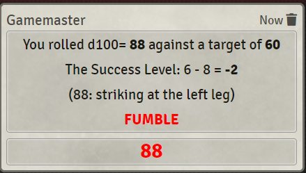
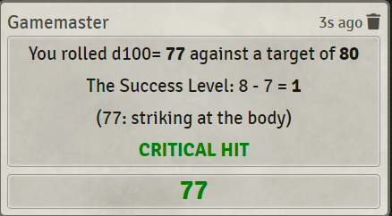

# WFRP4E simple dice rolling chat command for FoundryVTT #

This module enables a chat command for a *test* roll in the Warhammer Fantasy Roleplaying System. The module acts like a dice rolling bot for discord. Actually, Jodri a discord dice rolling bot for WFRP4E was the main inspiration for this module.

The module calculates the success level, automatic failure / success, hit zones, fumbles and critical hits. Nothing more, nothing less. Everything else must be done
by yourself via the core rules books: english [Cubicle7](https://cubicle7games.com/our-games/warhammer-fantasy-roleplay-2/), german [Ulisees](https://ulisses-spiele.de/spielsysteme/warhammer-40-000-warhammer-fantasy/).

You can use the module along with the offical FoundryVTT system [Warhammer Fantasy Roleplay 4th Edition](https://foundryvtt.com/packages/wfrp4e) for a full fledged Warhammer experience or just with the [Simple Worldbuilding System](https://foundryvtt.com/packages/worldbuilding).

If you find bugs or have other suggestions, feel free to contact me via discord: MrTheBino#7878

## Installation

Use this URL to install the module in foundry:

    https://github.com/MrTheBino/wfrp4e-simple-rolls/releases/download/latest/module.json
## Why does this module exists? ##

The main reason, why I created this module are the other great features of FoundryVTT (like fog of war, scenes, music etc) but I didn't want to use the WFRP4E official system for FoundryVTT. Don't get me wrong, it's great but we're using real paper
character sheets and we wanted to have a simple way of rolling dices with some small
calculations packaged in FoundryVTT.

In order to make a roll simply type "/wr TARGET_VALUE" in the chat window.

## Examples ##

    /wr 60

    /wr 60+20

